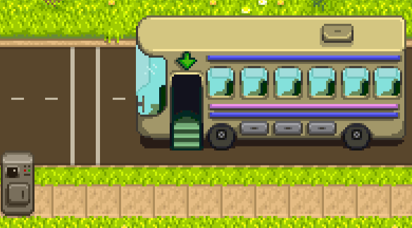

**Central Station** lets players travel to other mods' destinations by boat, bus, or train through the Central Station.

Mod authors can add custom destinations with optional ticket prices, and add ticket machines to their own maps using
map properties.

## Contents
* [For players](#for-players)
  * [Buy a ticket](#buy-a-ticket)
  * [Mod compatibility](#mod-compatibility)
* [For mod authors](#for-mod-authors)
* [See also](#see-also)

## For players
### Buy a ticket
To take the train, use the ticket machine at the railroad next to the station:  

To take the bus, use the ticket machine at the bus stop:  

For the boat, use the ticket machine in [Willy's back room](https://stardewvalleywiki.com/Fish_Shop#Willy.27s_Boat)
once the boat has been repaired:  

Alternatively, you can take any of those routes to the Central Station and then switch to another line from there. For
example, take the bus to Central Station and then switch onto a boat to Ginger Island.

You can also interact with ticket machines in various mod locations.

### Mod compatibility
There are no known conflicts with other mods.

Central Station automatically shows stops added through the Bus Locations and Train Station mods if they're installed
too.

## For mod authors
See the [author guide](author-guide.md) for more info!

## See also
* [Release notes](release-notes.md)
