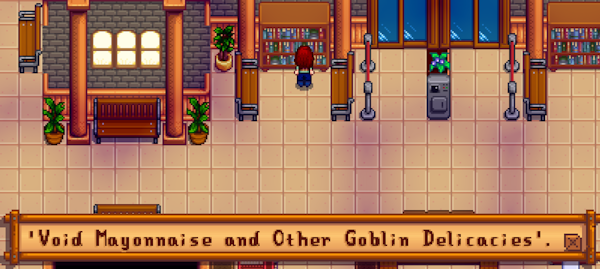

← [README](README.md)

This page helps mod authors use Central Station with their mods. **See the [main README](README.md) for other
info.**

> [!TIP]  
> This page covers everything you can do with Central Station. However, you probably only need the 'Basic usage'
section below.

## Contents
* [Basic usage](#basic-usage)
  * [Overview](#overview)
  * [Add a stop](#add-a-stop)
  * [Add a default ticket machine](#add-a-default-ticket-machine)
  * [Add a custom ticket machine](#add-a-custom-ticket-machine)
* [Advanced stops](#advanced-stops)
  * [Edit the railroad map](#edit-the-railroad-map)
  * [Conditional stops](#conditional-stops)
  * [Multi-network stops](#multi-network-stops)
* [Bookshelf messages](#bookshelf-messages)
* [Tourists](#tourists)
* [Mod integrations](#mod-integrations)
  * [Recolors](#recolors)
  * [C# mod API](#c-mod-api)
* [Lore guide](#lore-guide)
  * [General guidelines](#general-guidelines)
  * [Hidden lore](#hidden-lore)
* [FAQs](#faqs)
* [See also](#see-also)

## Basic usage
### Overview
This mod adds three transport networks (boat, bus, and train) which connect to the Central Station. Mods can add their
own stops to each network.

For example, let's say you add a custom island only reachable by boat. There are two ways to reach it:
* Get a ticket from [Willy's boat](https://stardewvalleywiki.com/Fish_Shop#Willy.27s_Boat) (or any ticket machine on
  the boat network) to go to the island.
* _Or_ get a ticket to the Central Station from any network, then get a boat ticket from there to your island.

Your stops are highly customizable with optional features like ticket pricing and conditions.

### Add a stop
To add a boat, bus, or train stop:

1. Create a [Content Patcher content pack](https://stardewvalleywiki.com/Modding:Content_Patcher) if you don't already
   have one.
2. In your `content.json`, add entries to the stops data asset:
   ```js
   {
       "Action": "EditData",
       "Target": "Mods/Pathoschild.CentralStation/Stops",
       "Entries": {
           "{{ModId}}_ClintShop": {
               "DisplayName": "Clint's Shop",
               "ToLocation": "Town",
               "Network": "Train",
               "ToTile": { "X": 105, "Y": 80 }
           }
       }
   }
   ```
3. Edit the data accordingly (see the fields below). You can list any number of stops in the same `EditData` patch.

The available fields for a stop are:

field name          | usage
------------------- | -----
_key_               | The entry key (not a field) is a [unique string ID][] for your stop. This must be prefixed with your unique mod ID like `{{ModId}}_`.
`DisplayName`       | The display name to show in the menu. This should usually be translated into the player's current language using Content Patcher's `i18n` token. You can use [tokenizable strings](https://stardewvalleywiki.com/Modding:Tokenizable_strings) in this field.
`ToLocation`        | The internal name of the location to which the player should be warped to. You can see internal location names in-game using [Debug Mode](https://www.nexusmods.com/stardewvalley/mods/679).
`ToTile`            | <p>_(Optional)_ The tile position to which the player should be warped to. You can see tile coordinates in-game using [Debug Mode](https://www.nexusmods.com/stardewvalley/mods/679).</p><p>If omitted, Central Station will place the player just south of the ticket machine (if present), else it'll use the [default arrival tile](https://stardewvalleywiki.com/Modding:Maps#Warps_.26_map_positions).</li></ul>
`ToFacingDirection` | _(Optional)_ The direction the player should face after warping. The possible values are `up`, `down`, `left`, and `right`. Default `down`.
`Network`           | _(Optional)_ How the player can reach the stop. This must be `Boat`, `Bus`, `Train`, or [multiple networks](#multi-network-stops). Defaults to `Train`.
`Cost`              | _(Optional)_ The gold price to purchase a ticket. Default free.
`Condition`         | _(Optional)_ If set, the [game state query][] which must be met for the stop to appear in the menu.
`DisplayNameInCombinedLists` | _(Optional)_ If set, overrides `DisplayName` when shown in a menu containing multiple transport networks. This is only needed if a stop name is reused for different transport networks (e.g. "Stardew Valley" for boat, bus, and train stops).

### Add a default ticket machine
To add Central Station's ticket machine automatically, just add this [map property](https://stardewvalleywiki.com/Modding:Maps)
(not tile property) to your map:
```
Pathoschild.CentralStation_TicketMachine <x> <y> [networks]
```

The arguments are:

argument   | usage
---------- | -----
`x y`      | The tile position where it should appear. This matches the machine's bottom tile (i.e. where it 'stands' on the map).
`networks` | _(Optional)_ The networks this ticket machine is connected to, which affects (a) which stops are shown and (b) which sound effects play while traveling. This must be `Boat`, `Bus`, `Train`, or [multiple networks](#multi-network-stops). Defaults to `Train` if omitted.

For example, to add a boat ticket machine to tile (5, 10):
```
Pathoschild.CentralStation_TicketMachine 5 10 Boat
```

### Add a custom ticket machine
You can add your own ticket machine, counter, or anything else thematically appropriate for your location to the map.
Then just add this [`Action` tile property](https://stardewvalleywiki.com/Modding:Maps#Action) where the player can
click to get tickets:

```
Action CentralStation [networks]
```

The argument is:

argument   | usage
---------- | -----
`networks` | _(Optional)_ The networks this ticket machine is connected to, which affects (a) which stops are shown and (b) which sound effects play while traveling. This must be `Boat`, `Bus`, `Train`, or [multiple networks](#multi-network-stops). Defaults to `Train` if omitted.

## Advanced stops
### Edit the railroad map
Central Station automatically adds a train ticket machine to `Maps/Railroad` on tile (32, 40).

If you edit the layout of that map, you can optionally add the ticket machine yourself. Central Station won't re-add
the machine if the `Action: CentralStation Train` tile property is already present, and it'll automatically adjust its
train stop to match the position of the ticket machine.

### Conditional stops
The `Condition` field in your stop data lets you decide when your stop should appear. The conditions are checked each
time the menu is opened, so this can be used for a wide variety of customizations.

For example, let's say you want to create your own hub station:
```
                                              ┌─────────────────┐
                                          ┌──>│ Your location A │
                                          │   └─────────────────┘
┌─────────────────┐   ┌────────────────┐  │   ┌─────────────────┐
│ Central Station ├──>│ Your rail stop ├──┼──>│ Your location B │
└─────────────────┘   └────────────────┘  │   └─────────────────┘
                                          │   ┌─────────────────┐
                                          └──>│ Your location C │
                                              └─────────────────┘
```

You can add a condition like this to the [stop data](#add-a-stop) for your location A–C, so they're only available from
your hub station:
```js
"Condition": "LOCATION_NAME Here {{ModId}}_YourRailStop"
```

See [Modding:Game state queries](https://stardewvalleywiki.com/Modding:Game_state_queries) on the wiki for the built-in
conditions, and you can also use any game state queries added by other mods.

### Multi-network stops
One stop can be on multiple networks at once. For example, Central Station is connected to the boat, bus, and train
networks.

This involves two changes:
* In your [stop data](#add-a-stop)'s `Network` field, add comma-delimited networks. For example:
  ```js
  "Network": "Boat, Bus"
  ```
* In map or tile properties, add **space**-delimited networks. For example:
  ```
  Action: CentralStation Boat Bus
  ```

## Bookshelf messages
Players can click a bookshelf in the Central Station to show a randomly-selected message, usually a book title or
similar message. For example:
> 

To add your own messages to the rotation:

1. In your `content.json`, use an `EditData` patch to add them to the data asset:
   ```js
   {
       "Action": "EditData",
       "Target": "Mods/Pathoschild.CentralStation/Bookshelf",
       "Entries": {
           "{{ModId}}": [
               "'Pufferchicks and Where to Find them'.",
               "'Pufferchicks Incorporated', a detailed analysis of pufferchick evolution through a corporate lens."
           ]
       }
   }
   ```
2. Add any number of messages to the array. These should usually use the `i18n` token to support translations.

## Tourists
The Central Station is scattered with random non-social NPCs (_tourists_), which remain for the duration of that day.
Each one is essentially a tiny map patch.

To add your own tourists:

1. [Create a map asset](https://stardewvalleywiki.com/Modding:Maps) with any number of 1x2 tourists on the `Buildings`
   and `Front` layers. This can include animations, tile rotation, tile properties, etc.

   For example:  
   

2. In your `content.json`, use an `EditData` patch to add your tourists to the pool. This data specifies (a) the map
   asset you defined above, and (b) the data for each tourist in the map.

   For example, this adds the first two tourists from step 1:
   ```js
   {
       "Action": "EditData",
       "Target": "Mods/Pathoschild.CentralStation/Tourists",
       "Entries": {
           "{{ModId}}": {
               "FromMap": "{{InternalAssetKey: assets/tourists.tmx}}",
               "Tourists": {
                   "Child": {
                       "Index": 0,
                       "Dialogue": [
                           "Hi.",
                           "I'm just waiting for my mom.",
                           "I'm not supposed to talk to strangers."
                       ]
                   },
                   "WomanInDress": {
                       "Index": 1,
                       "Condition": "DATE_RANGE Fall 1 1 Fall 15",
                       "Dialogue": [
                           "It's almost time for the fair in Stardew Valley! I've been looking forward to it.",
                           "Tickets to Stardew Valley are free too, since they're covered by the town."
                       ]
                   }
               }
           }
       }
   }
   ```
2. Edit the data accordingly (see the fields below). You can add any number of tourists in the same `EditData` patch.

### Map data
The available fields for each entry are:

<table>
<tr>
<th>field name</th>
<th>usage</th>
</tr>
<tr>
<td><em>key</em></td>
<td>

The entry key (not a field) is a [unique string ID][] for your tourist map. This must be prefixed with your unique mod
ID, like `{{ModId}}_Tourists`.

</td>
</tr>
<tr>
<td><code>FromMap</code></td>
<td>

The [asset name](https://stardewvalleywiki.com/Modding:Common_data_field_types#Asset_name) for the
[map](https://stardewvalleywiki.com/Modding:Maps) containing any number of 1x2 tourists on the `Buildings` and `Front`
layers. (Other layers will be ignored.)

The map can be any width and can use features like animations, tile rotation, [action tile
properties](https://stardewvalleywiki.com/Modding:Maps#Action), etc. There's no need for dialogue actions though,
since you can use the `Dialogue` field below.

</td>
</tr>
<tr>
<td><code>Tourists</code></td>
<td>

The data for each tourist in the map. Any tourists not listed in this field are ignored. See [_tourist
data_](#tourist-data) below.

</td>
</tr>
</table>

### Tourist data
Within a map entry's `Tourists` field, the available fields for each tourist are:

<table>
<tr>
<th>field name</th>
<th>usage</th>
</tr>
<tr>
<td><em>key</em></td>
<td>

The entry key (not a field) is a unique ID for this tourist within your tourist map. There's no need to prefix your mod
ID, since it's scoped to the tourist map entry.

</td>
</tr>
<tr>
<td><code>Index</code></td>
<td>

The tourist's position within the map file, counting left-to-right from zero:
```
┌───┬───┬───┐
│ 0 │ 1 │ 2 │
├───┼───┼───┤
│ 3 │ 4 │ 5 │
└───┴───┴───┘
```

</td>
</tr>

<tr>
<td><code>Dialogue</code></td>
<td>

_(Optional)_ An array of dialogues spoken by the tourist, if any. Each time the player clicks the tourist, it will show the
next dialogue in the list. Default none.

You can use `#` in dialogue text to split it into consecutive dialogue boxes, `^` to add newlines, and [gender-switch
blocks](https://stardewvalleywiki.com/Modding:Dialogue#Gender_switch).

Best practices:
* These should usually be translated into the player's current language using Content Patcher's `i18n` token.
* If your dialogue mentions the Central Station, see the [lore guide](#lore-guide).

</td>
</tr>
<tr>
<td><code>DialogueRepeats</code></td>
<td>

_(Optional)_ Once the player has seen all the dialogue lines in `Dialogue`, whether clicking the tourist again will
restart from the first dialogue (`true`) or do nothing (`false`). Default `false`.

</td>
</tr>
<tr>
<td><code>Condition</code></td>
<td>

_(Optional)_ A [game state query][] which indicates whether a tourist can appear today.

</td>
</tr>
</tr>
</table>

## Mod integrations
### Recolors
All custom tiles are in the `Maps/Pathoschild.CentralStation_Tiles` asset, which you can target with an `EditImage`
patch to recolor.

### C# mod API
Central Station has a [mod-provided API](https://stardewvalleywiki.com/Modding:Modder_Guide/APIs/Integrations#Mod-provided_APIs)
you can use to add destinations from a C# mod.

To add stops through the API:

1. Copy [`ICentralStationApi.cs`](../ICentralStationApi.cs) into your mod code, and **remove any methods you don't
   need**.
2. In [SMAPI's `GameLoop.GameLaunched` event](https://stardewvalleywiki.com/Modding:Modder_Guide/APIs/Events#GameLoop.GameLaunched),
   get the API:
   ```c#
   var centralStation = this.Helper.ModRegistry.GetApi<ICentralStationApi>("Pathoschild.CentralStation");
   if (centralStation is null)
       return; // Central Station not installed
   ```
3. Call methods on the API (see IntelliSense for documentation).

   For example, to register a stop:
   ```c#
   centralStation.RegisterStop(
       id: "ExampleLocation",                 // Central Station will prefix your mod ID automatically
       displayName: () => "Example Location", // you should usually use `helper.Translation.Get` to translate it
       toLocation: "Woods",
       toTile: null,
       toFacingDirection: Game1.down,
       cost: 100,
       network: "Bus",
       condition: null
   );
   ```

## Lore guide
The Central Station has a hidden backstory which is mentioned in some default content. If you add custom dialogue which
mentions Central Station, this optional lore guide can help you keep it consistent.

### General guidelines
This section has light spoilers.

* Central Station can only be reached and left via boat/bus/train transit lines.  
  _NPCs shouldn't mention reaching it any other way (e.g. walking, driving, or taking their own boat), and shouldn't
  mention going outside the station._
* It's connected to regular boat/bus/train lines.  
  _NPCs and players who transit through the station generally don't know there's anything unusual about it._
* Who runs and maintains Central Station is never revealed.  
  _In-game authorities like [the governor](https://stardewvalleywiki.com/Governor) are aware of the station and have
  permits issued, but don't recall who filed them. Nobody works for the station (e.g. the shop keepers are independent).
  No company has maintenance contracts with the station (e.g. for upkeep or maintenance)._
* The backstory is rarely hinted at, and never explicitly stated.  
  _If you want to hint at the backstory in custom dialogue, see the next section._


### Hidden lore
> [!WARNING]  
> **This section has heavy spoilers, including details that are never revealed in-game.**
>
> If you want the intended experience, **do not read this section**. This is only documented so that mod authors adding
> custom dialogue can hint at the backstory in a way that's consistent with the base mod.

> [!NOTE]  
> The hidden lore is meant to be a vague background 'feel' to the station, so it should rarely be mentioned and never
> directly explained. For example, only two default tourists have dialogues which vaguely hint at it.

<details>
<summary><em>View hidden lore (<strong>contains major spoilers</strong>):</em></summary>

The Central Station is in the spirit world, and it's run by unknown but friendly spirits. You can't reach the station
through normal means (e.g. driving along the road which the bus takes), and every transit destination seems to be
reachable (e.g. bus stops on another continent).

This spirit world is more dynamic and changeable than the physical world. The Central Station is kept stable for its
passengers, but sometimes the spirit world seeps through in a momentary 'flicker'. For players, this is visible as a
rare chance of strange occurrences (like briefly seeing into the ticket booth).

This is never directly revealed to players or NPCs, and it's not possible to discover who runs the station and remember
it. For example, there's a rare chance to see this message when you click the ticket counter:
> _(Suddenly you can see through the tinted glass, just for a moment. When you think back, you can't remember what you
> saw.)_

The spirits who operate the station are never described in any detail, only indirectly or via their actions. For
example, other rare messages state:
> (You try to peer into the ticket booth, but there's just a vague shadow through the tinted glass.)  
> (You hear strange whispers through the glass.)  
> (This machine only sells Joja Cola, but something thuds into the pickup tray as you approach.)

Messages which hint at this lore are generally eerie, strange, or otherworldly. However the spirits are always friendly,
helpful, or playfully mischievous; they are _never_ threatening, scary, malicious, or hurtful.


</details>

## FAQs
### Can I make Central Station optional?
Yep. Requiring it makes things easier for you (since you don't need to worry about fallback options), but you can
certainly make it optional.

For example, one simple approach:
1. Add your data patches per the above docs.
2. Add vanilla ticket machines to your maps with `Action Warp` [tile properties](https://stardewvalleywiki.com/Modding:Maps).
2. Add Central Station's [ticket machine map property](#add-a-default-ticket-machine), and specify the tile position of
   your default warps.

If Central Station is installed, it'll patch its ticket machine over your default warp based on the map property. This
replaces the `Buildings` and `Front` layers for the patched tiles, so the fallback `Action` will be replaced. If it's
not installed, your `EditData` patches will just be ignored and players will use your fallback warp.

## See also
* [README](README.md) for other info
* [Ask for help](https://stardewvalleywiki.com/Modding:Help)

[game state query]: https://stardewvalleywiki.com/Modding:Game_state_queries
[unique string ID]: https://stardewvalleywiki.com/Modding:Common_data_field_types#Unique_string_ID
